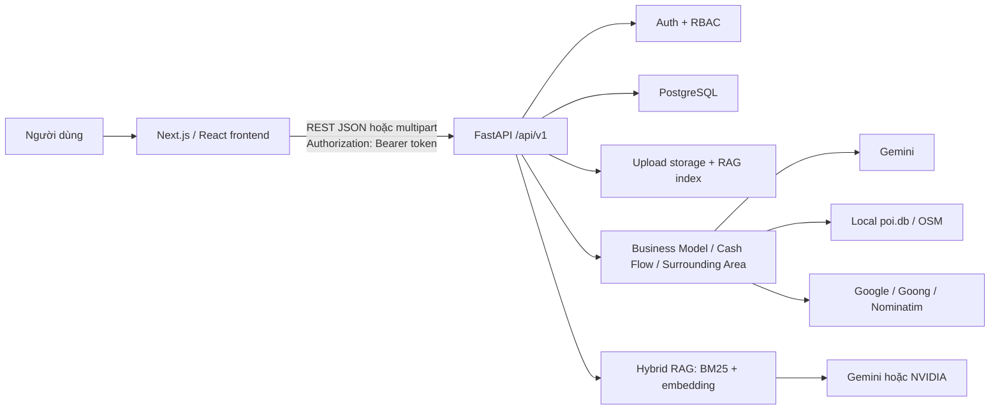
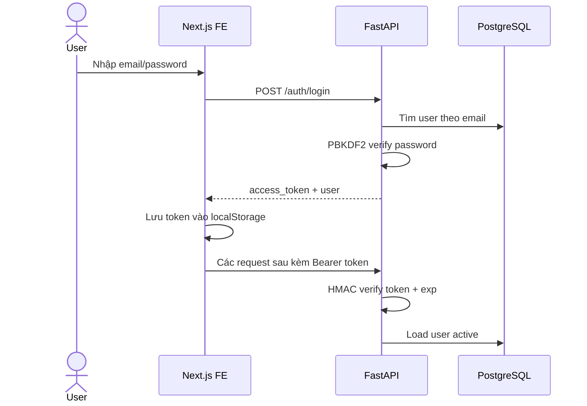
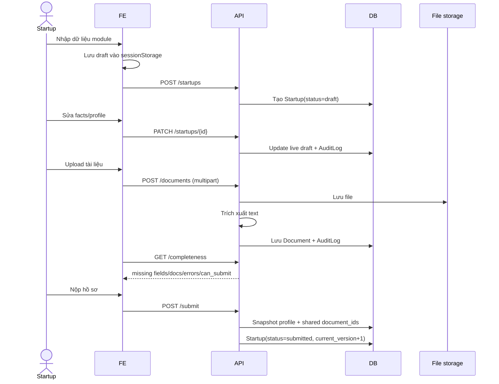
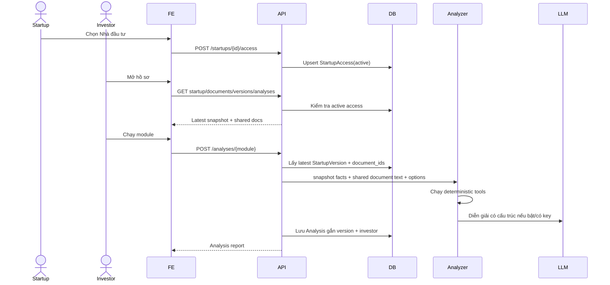
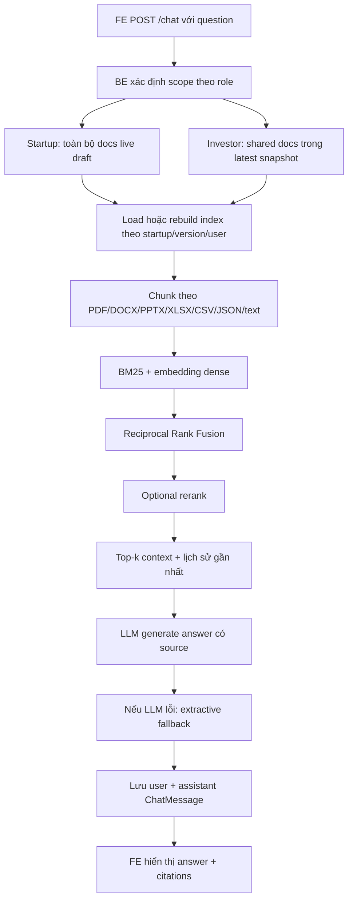
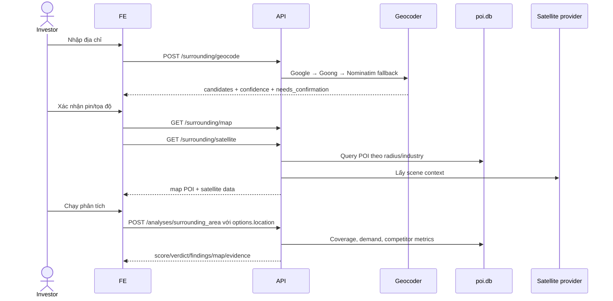

# Báo cáo review code: Chức năng hiện tại và luồng giao tiếp Frontend – Backend

> Dự án: **Startup Lens**  
> Thời điểm review: **18/07/2026**  
> Phạm vi: code hiện có trong working tree, bao gồm cả thay đổi chưa commit  
> Kiến trúc: **Next.js 16 + React 19 + TypeScript** ở frontend, **FastAPI + SQLAlchemy async + PostgreSQL** ở backend

## 1. Tóm tắt điều hành

Startup Lens hiện đã có một luồng nghiệp vụ tương đối đầy đủ cho hai vai trò:

- **Startup**: đăng ký/đăng nhập, tạo và sửa hồ sơ nháp, nhập dữ liệu theo ba module, tải tài liệu, kiểm tra độ đầy đủ, nộp/khóa phiên bản, tạo bản nháp tiếp theo, cấp/thu hồi quyền cho Nhà đầu tư và chat với tài liệu của mình.
- **Nhà đầu tư**: xem các hồ sơ được cấp quyền, xem snapshot/tài liệu đã chia sẻ, so sánh phiên bản, chạy ba module phân tích, xem bản đồ khu vực và chat RAG với tài liệu của phiên bản mới nhất.

Frontend không truy cập database hoặc LLM trực tiếp. Mọi giao tiếp đi qua REST API `/api/v1`; backend chịu trách nhiệm xác thực, phân quyền, chọn snapshot, đọc tài liệu, chạy tool deterministic và gọi LLM khi cần.

Luồng chính đã được thiết kế đúng hướng: **draft → completeness check → submitted snapshot → investor access → analysis/chat**. Tuy nhiên, review phát hiện một số điểm cần ưu tiên sửa trước khi dùng production:

1. Kết quả phân tích cũ có thể được hiển thị cùng phiên bản hồ sơ mới mà không có cảnh báo.
2. Snapshot tài liệu chưa thực sự bất biến vì `visibility` vẫn đọc từ bản ghi tài liệu mutable.
3. Lỗi Gemini ngoài trường hợp “chưa cấu hình” có thể làm mất toàn bộ kết quả phân tích deterministic.
4. Chỉ số “sẵn sàng” trên dashboard frontend khác quy tắc completeness của backend.
5. Xử lý file nặng đang chạy đồng bộ trong route `async`, có thể chặn event loop.

## 2. Sơ đồ kiến trúc hiện tại

### Thành phần chính

| Thành phần | Trách nhiệm |
|---|---|
| `frontend/lib/api.ts` | API client dùng chung, gắn Bearer token, serialize JSON/FormData và chuyển lỗi backend thành `Error` |
| `frontend/lib/auth.tsx` | Quản lý session phía client, lưu token trong `localStorage`, gọi `/auth/me`, login/register/logout |
| `frontend/app/*` | Các route/màn hình dashboard, login, tạo hồ sơ, chi tiết hồ sơ, phân tích và chat |
| `backend/app/main.py` | Khởi tạo FastAPI, CORS, lifespan, tạo/migrate bảng và mount router `/api/v1` |
| `backend/app/core/auth.py` | Xác thực Bearer token, kiểm tra role, ownership và quyền Nhà đầu tư |
| `backend/app/api/routes/*` | REST boundary cho auth, startup, document, analysis, chat và surrounding area |
| `backend/app/services/*` | Điều phối phân tích, đọc file và RAG chat |
| `backend/app/modules/*` | Logic chuyên môn của ba module và document chatbot |
| `backend/app/models/*` | User, Startup, StartupVersion, StartupAccess, Document, Analysis, ChatMessage, AuditLog |

## 3. Phân quyền và phạm vi dữ liệu

| Chức năng | Startup | Nhà đầu tư |
|---|:---:|:---:|
| Tự đăng ký/đăng nhập | Có | Có |
| Tạo hồ sơ | Có | Không |
| Sửa hồ sơ | Có, khi `draft` | Không |
| Tải tài liệu/đổi visibility | Có, khi `draft` | Không |
| Kiểm tra completeness | Có | Có thể gọi nếu đã được cấp quyền |
| Nộp và khóa phiên bản | Có | Không |
| Cấp/thu hồi quyền | Có | Không |
| Xem hồ sơ | Hồ sơ do mình sở hữu | Hồ sơ được cấp quyền, đọc từ snapshot mới nhất |
| Xem tài liệu | Tất cả tài liệu của hồ sơ | Tài liệu `shared` nằm trong snapshot mới nhất |
| Chạy/xem phân tích | Không | Có |
| Chat tài liệu | Có, scope bản nháp | Có, scope theo user + snapshot mới nhất |
| Geocode | Có | Có |
| POI map/satellite | Không qua API | Có |

Backend dùng trả về `404` cho tài nguyên không có quyền truy cập nhằm không làm lộ sự tồn tại của startup.

## 4. Chức năng frontend hiện tại

### 4.1 Đăng nhập và session

- Route: `/login`.
- Hỗ trợ đăng nhập và tự đăng ký với role `startup` hoặc `investor`.
- Sau login/register, FE lưu `access_token` vào `localStorage` với key `startup_lens_token`.
- `AuthProvider` gọi `GET /auth/me` khi app khởi động để khôi phục user.
- `AppChrome` điều hướng người chưa đăng nhập sang `/login`, và người đã đăng nhập khỏi `/login` về dashboard.

### 4.2 Dashboard `/`

- Gọi `GET /startups`.
- Startup thấy hồ sơ do mình sở hữu; Nhà đầu tư chỉ thấy hồ sơ được chia sẻ.
- Hiển thị số hồ sơ, số hồ sơ có ngành/địa điểm và tỷ lệ readiness trung bình.
- Có lối vào trang tạo hồ sơ, trang chi tiết và Document Copilot.

### 4.3 Tạo hồ sơ `/startups/new`

- Dữ liệu chưa gửi backend được lưu tạm trong `sessionStorage`.
- Form chia thành ba nhóm:
  - Business Model/Development Plan;
  - Cash Flow;
  - Surrounding Area.
- Khi bấm tạo, FE gọi `POST /startups` một lần với:
  - `name`, `industry`, `stage`, `primary_location`;
  - toàn bộ dữ liệu module nằm trong object `facts`.
- Sau thành công, FE xóa draft trong `sessionStorage` và chuyển tới `/startups/{id}`.

### 4.4 Trang chi tiết `/startups/{id}`

Khi tải trang, FE gọi song song các API theo role:

- Chung: hồ sơ, tài liệu, lịch sử phiên bản.
- Startup: thêm completeness, danh sách Nhà đầu tư và danh sách quyền đã cấp.
- Nhà đầu tư: thêm danh sách kết quả phân tích.
- Nếu có ít nhất hai phiên bản, FE gọi API diff để so sánh hai phiên bản gần nhất.

Chức năng cho Startup:

- Sửa profile/facts và lưu bằng `PATCH /startups/{id}`.
- Upload file bằng multipart form.
- Đổi visibility tài liệu giữa `shared`, `private`, `restricted`.
- Xem trường/tài liệu còn thiếu.
- Nộp và khóa phiên bản.
- Tạo draft mới dựa trên trạng thái dữ liệu hiện tại.
- Cấp hoặc thu hồi quyền Nhà đầu tư.

Chức năng cho Nhà đầu tư:

- Xem snapshot mới nhất và tài liệu được chia sẻ.
- Chạy lại Business Model hoặc Cash Flow trực tiếp.
- Mở workflow riêng cho Surrounding Area.
- Xem điểm, tóm tắt, rủi ro, dữ liệu thiếu và chi tiết Cash Flow.

### 4.5 Document Copilot

- Có widget nổi trong trang chi tiết và trang riêng `/startups/{id}/chat`.
- Khi mở, FE gọi `GET /chat/history`.
- Khi gửi câu hỏi, FE thêm optimistic user/pending assistant turn rồi gọi `POST /chat`.
- Response hiển thị câu trả lời, citation, vị trí trang/sheet/dòng, retrieval mode và provider.

### 4.6 Surrounding Area UI

- Nhà đầu tư nhập địa chỉ và gọi geocode.
- FE hiển thị danh sách candidate và bắt buộc người dùng xác nhận tọa độ trước khi phân tích.
- Khi có tọa độ, FE tự gọi song song:
  - `GET /surrounding/map` để lấy POI;
  - `GET /surrounding/satellite` để lấy ngữ cảnh ảnh vệ tinh.
- Bản đồ ưu tiên Google Maps nếu có key; nếu không sẽ fallback Esri/OSM/Leaflet.
- Khi chạy phân tích, FE gửi `options` chứa dependency, tọa độ, bán kính, claims, profile địa điểm và cờ `include_satellite`.

## 5. REST API backend hiện tại

Tất cả đường dẫn dưới đây có prefix `/api/v1`.

| Method | Endpoint | Quyền | Chức năng chính |
|---|---|---|---|
| `GET` | `/health` | Public | Health check |
| `POST` | `/auth/register` | Public | Tạo user, hash mật khẩu, trả token + user |
| `POST` | `/auth/login` | Public | Xác minh email/password/status, trả token + user |
| `GET` | `/auth/me` | Đăng nhập | Lấy user hiện tại |
| `GET` | `/auth/investors` | Startup | Lấy danh sách investor active để cấp quyền |
| `GET` | `/startups` | Đăng nhập | Danh sách theo ownership/access |
| `POST` | `/startups` | Startup | Tạo hồ sơ draft |
| `GET` | `/startups/{id}` | Có quyền | Startup đọc live draft; investor đọc snapshot mới nhất |
| `PATCH` | `/startups/{id}` | Owner + draft | Sửa profile và facts |
| `GET` | `/startups/{id}/completeness` | Có quyền | Kiểm tra field, document và format |
| `POST` | `/startups/{id}/submit` | Owner + draft | Tạo `StartupVersion`, khóa profile hiện tại |
| `POST` | `/startups/{id}/draft` | Owner | Chuyển hồ sơ submitted về draft để cập nhật tiếp |
| `GET` | `/startups/{id}/versions` | Có quyền | Lấy toàn bộ snapshot đã nộp |
| `GET` | `/startups/{id}/versions/diff` | Có quyền | Flatten snapshot/facts và so sánh hai version |
| `GET` | `/startups/{id}/access` | Owner | Danh sách quyền investor |
| `POST` | `/startups/{id}/access` | Owner | Cấp/kích hoạt lại quyền |
| `DELETE` | `/startups/{id}/access/{investor_id}` | Owner | Thu hồi quyền |
| `GET` | `/startups/{id}/documents` | Có quyền | Owner thấy tất cả; investor thấy shared docs của latest version |
| `POST` | `/startups/{id}/documents` | Owner + draft | Validate extension/size, lưu file, trích xuất text, ghi DB |
| `PATCH` | `/startups/{id}/documents/{document_id}` | Owner + draft | Đổi visibility |
| `GET` | `/startups/{id}/analyses` | Investor có quyền | Lấy các analysis do chính investor đó tạo |
| `POST` | `/startups/{id}/analyses/{module}` | Investor có quyền | Chạy module trên latest snapshot và shared docs |
| `GET` | `/startups/{id}/chat/history` | Có quyền | Lịch sử chat cô lập theo user và version/draft |
| `POST` | `/startups/{id}/chat` | Có quyền | RAG retrieval + LLM/fallback, lưu hai message |
| `POST` | `/surrounding/geocode` | Đăng nhập | Địa chỉ → candidate tọa độ cần xác nhận |
| `GET` | `/surrounding/map` | Investor | Lấy POI từ local `poi.db` |
| `GET` | `/surrounding/satellite` | Investor | Lấy scene metadata/quicklook vệ tinh |

### Contract truyền dữ liệu

- JSON được dùng cho hầu hết request/response.
- Upload dùng `multipart/form-data` với field `file`.
- ID dùng UUID dạng string trên FE và `UUID` ở schema BE.
- Thời gian trả ISO datetime và được FE format bằng `toLocaleString("vi-VN")`.
- Lỗi BE thường có dạng `{ "detail": "..." }`; API client FE lấy `detail` làm message.
- `204 No Content` được API client xử lý riêng.

## 6. Luồng end-to-end giữa FE và BE

### 6.1 Đăng nhập

### 6.2 Tạo, hoàn thiện và nộp hồ sơ

Completeness hiện yêu cầu 10 nhóm dữ liệu: tên, ngành, giai đoạn, địa điểm, problem, solution, target customers, revenue model, current cash, financial periods; đồng thời cần ít nhất một tài liệu `shared` và `current_cash` không âm.

### 6.3 Chia sẻ và thẩm định

### 6.4 Chat RAG tài liệu

Index RAG được namespace theo provider/model và scope key gồm startup, version/draft và user. Nếu embedding không hoạt động, hệ thống vẫn dùng BM25.

### 6.5 Phân tích khu vực

## 7. Luồng nội bộ của ba module phân tích

### 7.1 Business Model

1. Whitelist facts thuộc Business Model/Development Plan; loại dữ liệu cash flow và location khỏi boundary.
2. Tính độ đầy đủ dữ liệu bằng code deterministic.
3. Nếu đủ input, tính contribution/order economics.
4. Chỉ tính TAM/SAM/SOM khi `options.market_size_inputs` có đủ input cấu trúc.
5. Nếu bật agent flow, chạy bốn domain agent song song:
   - Customer & Value Proposition;
   - Retail Model & Channels;
   - Economics & Market Evidence;
   - Development Plan.
6. Auditor loại claim thiếu evidence hoặc vượt scope.
7. Composer tạo báo cáo từ các finding đã được audit.
8. Nếu Gemini chưa cấu hình/lỗi, trả deterministic fallback.

Điểm Business Model hiện mang nghĩa **data completeness**, không phải xác suất thành công hay quyết định đầu tư.

### 7.2 Cash Flow

1. Extract dữ liệu cash flow từ tài liệu và facts.
2. Normalize thành dataset thống nhất.
3. Classify transaction, loại duplicate và reconcile số dư.
4. Aggregate theo kỳ.
5. Tính operating burn, runway và cash-flow state bằng `Decimal`.
6. Chạy base/adverse/severe scenarios.
7. Tính break-even nếu có fixed monthly costs và variable-cost ratio.
8. Chấm điểm dựa trên metrics, reconciliation và nguồn dữ liệu.
9. Sinh risk/missing data/tool calls/evidence; Gemini chỉ diễn giải, không tự tính lại số.

### 7.3 Surrounding Area

1. Xác định ngành có phụ thuộc vị trí hay không; ngành độc lập trả `not_applicable`, không chấm 0.
2. Resolve location từ profile hoặc `options.location` do FE vừa xác nhận.
3. Nếu thiếu tọa độ, trả `insufficient_data`.
4. Query local OSM `poi.db` để lấy đối thủ, demand proxy và tổng POI.
5. Đánh giá coverage; dữ liệu quá mỏng thì không kết luận saturation và không ép score 0.
6. Tính mật độ/ring metrics và đối chiếu các claim của startup.
7. Tạo map payload, Google Places enrichment tùy cấu hình và satellite context tùy option.
8. Chỉ sinh score khi coverage và tín hiệu cạnh tranh/cầu đủ đo lường.

## 8. Dữ liệu và tính cô lập

### Các entity quan trọng

| Entity | Vai trò |
|---|---|
| `User` | Tài khoản, role, status, password hash |
| `Startup` | Bản live hiện tại, owner, facts, status và current_version |
| `StartupVersion` | Snapshot profile + danh sách shared document ID tại lúc submit |
| `StartupAccess` | Quyền investor theo startup, active/revoked |
| `Document` | Metadata file, đường dẫn, extracted text, visibility |
| `Analysis` | Report gắn startup version và investor tạo report |
| `ChatMessage` | Message gắn startup, user và startup version hoặc draft |
| `AuditLog` | Ghi nhận các hành vi chính như create/update/submit/access/analyze/upload |

### Cơ chế scope

- Investor phải có `StartupAccess.status == "active"`.
- Profile investor lấy từ `StartupVersion` mới nhất thay vì bản live draft.
- Analysis gắn `startup_version_id` và `created_by_id`.
- Chat history gắn user; với investor còn gắn version mới nhất.
- RAG index key có cả startup/version/user, hạn chế lẫn dữ liệu giữa investor và phiên bản.

## 9. Kết quả code review và khuyến nghị

### P1 — Analysis của phiên bản cũ có thể hiển thị như kết quả của phiên bản mới

**Bằng chứng:** `backend/app/api/routes/analyses.py:43-45` chỉ lọc `startup_id` và `created_by_id`; FE `frontend/app/startups/[id]/page.tsx:39-43` lấy bản ghi đầu tiên theo module mà không đối chiếu `startup_version_id`.

**Kịch bản:** investor chạy Cash Flow cho V1; startup nộp V2; investor mở V2 nhưng danh sách vẫn trả report V1. UI có thể hiển thị điểm V1 cạnh dữ liệu V2 mà không cảnh báo.

**Khuyến nghị:** mặc định lọc analysis theo latest `StartupVersion.id`; nếu muốn xem lịch sử, bổ sung query `version_id` và hiển thị badge `Vn` rõ ràng trên FE.

### P1 — Snapshot tài liệu chưa thực sự bất biến

**Bằng chứng:** version chỉ lưu `document_ids`; các route investor còn yêu cầu `Document.visibility == "shared"` tại thời điểm đọc (`documents.py:42`, `chat.py:38`, `analyses.py:70`). Trong draft mới, `documents.py:111` vẫn cho đổi visibility của cùng bản ghi.

**Tác động:** một tài liệu đã nằm trong V1 có thể biến mất khỏi view/chat/analysis của V1 sau khi Startup tạo draft mới và đổi tài liệu thành private/restricted.

**Khuyến nghị:** snapshot cả metadata/visibility/content hash hoặc tạo `StartupVersionDocument`; tối thiểu không cho sửa visibility của document đã khóa, hoặc clone document record cho draft mới.

### P1 — Lỗi Gemini transient có thể làm thất bại analysis deterministic

**Bằng chứng:** `backend/app/services/analysis_service.py:45` chỉ bắt `GeminiNotConfiguredError`. Timeout, quota sau retry, lỗi parse structured output hoặc lỗi provider khác sẽ bubble thành HTTP 500.

**Tác động:** analyzer đã tính xong report nhưng user vẫn nhận lỗi và report không được lưu.

**Khuyến nghị:** bắt nhóm lỗi provider/timeout/validation, ghi warning vào `report.details["llm"]`, rồi trả report deterministic; chỉ fail request khi deterministic analyzer thất bại.

### P1/P2 — Parsing file đồng bộ trong async request

**Bằng chứng:** `documents.py:59-67` đọc toàn bộ file rồi gọi trực tiếp `extract_text(path)`; PDF/DOCX/PPTX/XLSX parser đều đồng bộ.

**Tác động:** file lớn hoặc workbook phức tạp có thể chặn event loop, tăng latency cho tất cả request cùng worker.

**Khuyến nghị:** chuyển parsing sang `asyncio.to_thread` hoặc background job; lưu trạng thái `processing/processed/failed`; thêm timeout và giới hạn page/row/cell.

### P2 — Readiness frontend không cùng contract với completeness backend

**Bằng chứng:** dashboard `frontend/app/page.tsx:26-43` tính 12 field riêng, có `monthly_revenue/monthly_expense`; backend `startups.py:30-41` dùng 10 field và bắt buộc `financial_periods` + tài liệu shared.

**Tác động:** dashboard có thể báo “gần đủ” trong khi backend không cho submit, hoặc ngược lại.

**Khuyến nghị:** dùng một endpoint summary/completeness cho dashboard, hoặc chia sẻ schema/rule version giữa FE và BE. Không nên duy trì hai công thức độc lập.

### P2 — `restricted` chưa có semantics riêng

Backend nhận `private/shared/restricted`, nhưng investor query chỉ cho `shared`; chưa có bảng hoặc API chỉ định investor nào được xem `restricted`.

**Khuyến nghị:** hoặc bỏ `restricted` khỏi UI/contract, hoặc thiết kế access list ở cấp document.

### P2 — Session hết hạn chưa được xử lý tập trung

`frontend/lib/api.ts` ném lỗi cho mọi non-2xx nhưng không có nhánh 401 để xóa token và đưa user về login. User state trong `AuthProvider` có thể vẫn tồn tại tới khi reload.

**Khuyến nghị:** central 401 handler/logout, hoặc event/callback từ API client sang AuthProvider. Với production, cân nhắc cookie `HttpOnly`, `Secure`, `SameSite` thay cho localStorage để giảm rủi ro token bị đọc khi có XSS.

### P2 — Rate limiter phụ thuộc `request.client.host`

`backend/app/api/routes/surrounding.py:67-69` dùng IP mà ASGI thấy. Sau reverse proxy, nhiều người có thể chung một IP nội bộ và chặn lẫn nhau; nếu tin trực tiếp `X-Forwarded-For` mà không cấu hình trusted proxy thì lại có thể bị spoof.

**Khuyến nghị:** cấu hình trusted proxy đúng ở hạ tầng và dùng Redis/distributed limiter với key kết hợp user ID + IP + endpoint.

### P2 — Tính nhất quán file system và database

Upload ghi file trước khi commit DB. Nếu flush/commit lỗi, file có thể bị orphan. Hiện cũng chưa có API xóa tài liệu/index và chưa thấy job cleanup.

**Khuyến nghị:** cleanup file khi transaction lỗi, thêm lifecycle delete/archive, và invalidation RAG index rõ ràng.

### P3 — Contract upload FE/BE lệch nhẹ

Backend chấp nhận `.json`, nhưng `accept` ở FE không có `.json`. Người dùng không chọn được JSON qua file picker dù API hỗ trợ.

### P3 — Cảnh báo tối ưu ảnh Next.js

ESLint báo hai chỗ dùng `` trong `SurroundingArea.tsx` (dòng 511 và 525). Không phải lỗi chức năng, nhưng ảnh vệ tinh có thể ảnh hưởng LCP/bandwidth.

## 10. Kết quả kiểm tra thực tế

| Kiểm tra | Kết quả |
|---|---|
| `npm run lint` | Pass, 0 error; 2 warning `` |
| `npm run build` | Pass; TypeScript và production build thành công, 8 route được build |
| Backend unit subset | 182 pass, 38 skip, 1 fail do thiếu package `osmium` trong môi trường review |
| Full backend test collection | Chưa chạy hết; dừng khi import vì môi trường thiếu `openpyxl` |
| Python môi trường review | 3.11.9, trong khi `pyproject.toml` yêu cầu Python >= 3.12 |

Hai lỗi backend trên là lỗi môi trường dependency của máy review, chưa phải bằng chứng rằng logic test tương ứng hỏng. Cần chạy lại trong image Docker hoặc virtualenv Python 3.12 với `pip install -e ".[dev]"` để có kết luận CI đầy đủ.

## 11. Đánh giá mức độ hoàn thiện

| Hạng mục | Trạng thái |
|---|---|
| Auth + RBAC cơ bản | Đã có |
| CRUD hồ sơ draft | Đã có |
| Completeness + submit snapshot | Đã có |
| Lịch sử và diff phiên bản | Đã có ở mức profile snapshot |
| Chia sẻ theo investor | Đã có |
| Upload + text extraction | Đã có, cần tách background cho production |
| Business Model analysis | Đã có deterministic + agent flow/fallback |
| Cash Flow analysis | Đã có deterministic pipeline khá đầy đủ |
| Surrounding Area analysis | Đã có geocode, POI, coverage, claims, map, satellite |
| Document RAG chat | Đã có hybrid retrieval, citations và fallback |
| Version-correct analysis history | Chưa hoàn chỉnh |
| Immutable document snapshot | Chưa hoàn chỉnh |
| Production-grade session/rate limit/job processing | Chưa hoàn chỉnh |

## 12. Thứ tự khuyến nghị triển khai tiếp

1. Sửa scope analysis theo version và hiển thị version trên FE.
2. Làm bất biến tài liệu của `StartupVersion`.
3. Đảm bảo LLM failure không làm mất deterministic report.
4. Đồng bộ readiness/completeness thành một nguồn sự thật.
5. Chuyển parsing/ingestion file sang background processing.
6. Hoàn thiện 401/session, distributed rate limit và file/index lifecycle.
7. Chuẩn hóa môi trường Python 3.12 và chạy full CI trong Docker.

---

### Các file trọng tâm đã review

- `frontend/lib/api.ts`, `frontend/lib/auth.tsx`, `frontend/types/index.ts`
- `frontend/app/page.tsx`, `frontend/app/login/page.tsx`
- `frontend/app/startups/new/*`, `frontend/app/startups/[id]/*`
- `backend/app/main.py`, `backend/app/api/router.py`
- `backend/app/api/routes/auth.py`, `startups.py`, `documents.py`, `analyses.py`, `chat.py`, `surrounding.py`
- `backend/app/core/auth.py`, `security.py`, `config.py`
- `backend/app/services/analysis_service.py`, `chat_service.py`, `document_parser.py`
- `backend/app/modules/business_model/*`, `cash_flow/*`, `surrounding_area/*`, `document_chatbot/*`
- `backend/app/models/*`, `backend/app/schemas/*`, các test backend và cấu hình Docker/Next.js
