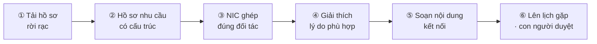

# Hải Đăng Khởi Nghiệp

> **Hải Đăng Khởi Nghiệp biến hồ sơ phân mảnh của một startup thành _hồ sơ nhu cầu có cấu trúc_, rồi giúp NIC tìm đúng đối tác trong hệ sinh thái, giải thích vì sao phù hợp, soạn sẵn nội dung kết nối và đưa cuộc gặp vào lịch — mọi bước then chốt đều đi qua sự phê duyệt của con người.**

Hãy hình dung: một nhà sáng lập chuỗi cà phê có tất cả những gì cần để thuyết phục một nhà đầu tư — doanh thu đang lên, hợp đồng mặt bằng tốt, một đội ngũ lì đòn. Nhưng câu chuyện ấy nằm rải rác trong một pitch deck, ba file Excel, vài hợp đồng PDF và một cuốn sổ tay. Ở đầu bên kia, một chuyên viên kết nối của NIC nhìn thấy hàng trăm startup và hàng trăm đối tác mỗi tháng, và phải đoán xem ai nên gặp ai. **Hai người cần nhau, nhưng không có cách nào để tìm thấy nhau đủ nhanh và đủ tin cậy.**

Hải Đăng Khởi Nghiệp sinh ra để lấp đúng khoảng trống đó. Như một **ngọn hải đăng** giữa hệ sinh thái đổi mới sáng tạo, nó soi rõ: startup này đang thật sự cần gì, ai trong mạng lưới có thể đáp ứng, vì sao hai bên phù hợp — và giúp cuộc gặp đầu tiên diễn ra **đúng người, đúng lúc, có bằng chứng**.

Điểm khác biệt cốt lõi: **AI ở đây không đoán mò và không tự ý hành động.** Mọi phép tính, đối soát và chấm điểm phù hợp đều chạy bằng công cụ deterministic có thể kiểm chứng; mô hình ngôn ngữ (LLM) chỉ diễn giải, tổng hợp và soạn thảo _dựa trên bằng chứng đã có_. Và ở mọi bước gửi đi, **con người là người bấm nút cuối cùng.**

## Link nhanh

| Hạng mục | Link |
|---|---|
| **Ứng dụng (production)** | https://hackathon-fpt-17-07-2026-da-quan-te.vercel.app/ |
| **Repository GitHub** | https://github.com/VTTr2004/hackathon-fpt-17-07-2026-da-quan-team |
| Slide thuyết trình | https://canva.link/ztb22appi6ergwa |
| Video demo | TODO: dán link YouTube/Google Drive video demo |

### Tài khoản demo (vai trò nhà đầu tư)

| Trường | Giá trị |
|---|---|
| Email | `InvesterVAIC2026@gmail.com` |
| Mật khẩu | `123456789` |

> Đăng nhập bằng tài khoản trên để trải nghiệm vai trò **nhà đầu tư**: xem hồ sơ được chia sẻ, chạy các module phân tích, xem gợi ý ghép cặp và chat hỏi–đáp trên tài liệu. Dòng Video demo sẽ cập nhật khi nộp bài.

## Mục lục

- [Bài toán: vì sao kết nối hệ sinh thái vẫn khó](#bài-toán-vì-sao-kết-nối-hệ-sinh-thái-vẫn-khó)
- [Hành trình người dùng](#hành-trình-người-dùng)
- [Câu chuyện khách hàng: Góc Hồ Coffee](#câu-chuyện-khách-hàng-góc-hồ-coffee)
- [Đối tượng người dùng](#đối-tượng-người-dùng)
- [Hệ thống hoạt động như thế nào](#hệ-thống-hoạt-động-như-thế-nào)
- [Nguyên tắc: AI có trách nhiệm](#nguyên-tắc-ai-có-trách-nhiệm)
- [Tối ưu quy trình & tiết kiệm thời gian](#tối-ưu-quy-trình--tiết-kiệm-thời-gian)
- [Giá trị mang lại](#giá-trị-mang-lại)
- [Tác động tích cực](#tác-động-tích-cực)
- [Công nghệ](#công-nghệ)
- [Tài liệu kỹ thuật](#tài-liệu-kỹ-thuật)

## Bài toán: vì sao kết nối hệ sinh thái vẫn khó

Hệ sinh thái khởi nghiệp không thiếu người muốn giúp nhau — thiếu là **đúng người gặp đúng người vào đúng lúc**. Bốn điểm nghẽn lặp đi lặp lại:

- **Startup nói một đằng, hồ sơ nằm một nẻo.** Nhu cầu thật sự (cần bao nhiêu vốn, cần cố vấn ngành nào, cần nhà cung cấp gì, muốn mở thị trường nào) bị chôn trong pitch deck, bảng tính bán hàng, hợp đồng PDF và ghi chú vận hành. Không ai đọc kịp, nên nhu cầu thường bị hiểu sai ngay từ bước đầu tiên.
- **Nhà điều phối hệ sinh thái quá tải.** Một đầu mối như NIC nhìn thấy hàng trăm startup và hàng trăm đối tác. Việc ghép cặp vẫn phụ thuộc trí nhớ, quan hệ cá nhân và cả may mắn — rất khó nhân rộng mà vẫn giữ chất lượng.
- **Kết nối chung chung thì không ai trả lời.** Email giới thiệu sao chép hàng loạt, không nói được _vì sao_ hai bên nên gặp nhau, khiến tỷ lệ phản hồi thấp và bào mòn thiện chí của cả mạng lưới.
- **AI dễ tạo niềm tin giả.** Nếu để AI tự do gợi ý rồi tự gửi đi, hệ thống có thể ghép sai, viết sai, thậm chí đặt lịch sai — mà nghe vẫn rất thuyết phục.

Hải Đăng Khởi Nghiệp giải quyết cả bốn điểm này bằng một nguyên tắc xuyên suốt: **có cấu trúc, có bằng chứng, có con người phê duyệt.**

## Hành trình người dùng

Sáu bước, từ một mớ tài liệu rời rạc đến một cuộc gặp đã lên lịch:

**① Từ mớ tài liệu rời rạc → một hồ sơ sống.**
Nhà sáng lập kéo–thả pitch deck, sổ thu chi Excel, hợp đồng thuê mặt bằng và vài ghi chú vận hành. Hệ thống trích xuất, đối soát số liệu và dựng nên một hồ sơ có cấu trúc — mỗi con số đều truy về được nguồn (file, trang, sheet, dòng). Người dùng chỉ cần xác nhận, không phải gõ lại từ đầu.

**② Hồ sơ nhu cầu có cấu trúc.**
Thay vì một bản pitch mơ hồ, họ nhận về một _hồ sơ nhu cầu_ rõ ràng: cần bao nhiêu vốn cho giai đoạn nào, thiếu năng lực gì, đang mạnh ở đâu — kèm cảnh báo dữ liệu còn thiếu. Chính lớp cấu trúc này khiến việc ghép cặp trở nên khả thi và công bằng.

**③ NIC tìm đúng đối tác trong hệ sinh thái.**
Chuyên viên NIC mở bàn điều phối và thấy danh sách đối tác phù hợp được xếp hạng theo **fit score nhiều chiều** (ngành, giai đoạn, địa bàn, năng lực, khẩu vị đầu tư…). Không còn lục trí nhớ — mạng lưới tự đẩy lên đúng vài cái tên đáng gặp nhất.

**④ Giải thích vì sao phù hợp.**
Mỗi gợi ý đi kèm lý do có bằng chứng: hai bên khớp ở điểm nào, còn khoảng trống nào, và câu hỏi nào nên hỏi trong buổi gặp. Người điều phối tin được vì mọi nhận định đều dẫn nguồn — không phải "AI bảo thế".

**⑤ Soạn sẵn nội dung kết nối.**
Hệ thống viết trước lời giới thiệu cá nhân hóa cho cả hai phía — đúng ngữ cảnh, đúng nhu cầu, nêu rõ vì sao nên gặp. Người điều phối chỉ chỉnh vài câu thay vì viết từ trang trắng.

**⑥ Đưa cuộc gặp vào lịch — với sự phê duyệt của con người.**
Khi người điều phối bấm duyệt, hệ thống đề xuất khung giờ và đưa cuộc gặp vào lịch. AI chuẩn bị mọi thứ tới sát mép; **con người là người ra quyết định gửi đi.**

Xuyên suốt hành trình, một trợ lý hỏi–đáp cho phép mọi bên chất vấn trực tiếp trên tài liệu ("doanh thu thuần 3 tháng là bao nhiêu?") và nhận câu trả lời **có trích dẫn nguồn** — giữ mọi cuộc trò chuyện bám chặt vào bằng chứng.

## Câu chuyện khách hàng: Góc Hồ Coffee

*(Câu chuyện dưới đây dựa trên hồ sơ mẫu **Góc Hồ Coffee** có sẵn trong hệ thống, dùng để minh họa trọn vẹn trải nghiệm.)*

### Bối cảnh

Chị Hà là chủ **Góc Hồ Coffee** — một quán cà phê nhỏ nằm ven hồ, mở được 18 tháng. Quán có lượng khách quen ổn định, dòng tiền đã dương và một vị trí đẹp hiếm có. Chị muốn mở **điểm bán thứ hai**, nhưng để làm được thì cần hai thứ chị chưa có: **một khoản vốn giai đoạn đầu** và **một người cố vấn hiểu chuỗi cung ứng F&B**.

Chị Hà không thiếu số liệu — quán ghi chép khá kỹ. Vấn đề là mọi thứ nằm ở những nơi khác nhau, và chị không phải dân tài chính hay gọi vốn.

### Vấn đề

- **Dữ liệu phân mảnh:** doanh thu nằm trong một file Excel nhiều sheet, hợp đồng thuê mặt bằng là PDF scan, còn "pitch" chỉ là vài slide sơ sài.
- **Không biết trình bày nhu cầu:** chị biết mình cần vốn và cố vấn, nhưng không biết diễn đạt thành một hồ sơ đủ rõ để người lạ tin trong vài phút.
- **Lọt lưới ở phía điều phối:** khi hồ sơ của chị đến NIC, nó nằm lẫn trong hàng trăm hồ sơ khác. Chuyên viên kết nối khó biết nên nối chị Hà với ai, và vì sao.
- **Kết nối chung chung không ai trả lời:** vài lời giới thiệu trước đây được viết vội, chung chung, nên rơi vào im lặng.

### Điều đã xảy ra

1. **Gom về một chỗ.** Chị Hà kéo–thả sổ thu chi Excel, hợp đồng thuê PDF và bộ slide vào hồ sơ. Hệ thống đọc bảng tính theo từng sheet/ô và trích ra các con số chủ chốt — *doanh thu thuần 3 tháng ≈ 671,3 triệu VND*, *số dư cuối kỳ ≈ 439,4 triệu VND* — **mỗi số kèm trích dẫn** về đúng dòng trong file gốc, nên ai cũng kiểm chứng được.
2. **Thành hồ sơ nhu cầu rõ ràng.** Từ mớ dữ liệu, hệ thống dựng nên hồ sơ nhu cầu: *cần vốn giai đoạn đầu để mở điểm bán thứ hai + một cố vấn chuỗi cung ứng F&B*; điểm mạnh là **dòng tiền dương** và **vị trí đắc địa** — được kiểm chứng bằng bản đồ POI và ảnh vệ tinh, kèm cảnh báo những trường còn thiếu.
3. **Được ghép với đúng người.** Trên bàn điều phối của NIC, Góc Hồ Coffee nổi lên cùng hai gợi ý được xếp hạng: một **nhà đầu tư khẩu vị F&B** và một **nhà cung cấp bao bì** trong mạng lưới.
4. **Có lý do để tin.** Mỗi gợi ý đi kèm giải thích *dựa trên chính các con số đã trích* — hai bên khớp ở đâu, còn khoảng trống gì, nên hỏi gì khi gặp. Không phải "AI bảo thế".
5. **Kết nối và lên lịch, có người duyệt.** Một lời giới thiệu cá nhân hóa được soạn sẵn; chuyên viên NIC chỉ rà và chỉnh vài câu, **bấm duyệt**, rồi cuộc gặp được đưa vào lịch. Con người vẫn là người quyết định gửi đi.

### Dự án đã mang lại gì

- **Cho chị Hà:** thay vì loay hoay với file rời rạc, chị có một hồ sơ nhu cầu rõ ràng, số liệu **có bằng chứng**, và được giới thiệu tới đúng hai đối tác — kèm lý do để đối phương muốn gặp.
- **Cho NIC:** thay vì đoán bằng trí nhớ, chuyên viên có cơ sở để ghép cặp, giải thích được với cả hai phía, và kết nối nhanh hơn nhiều mà **vẫn kiểm soát từng bước**.
- **Cho đối tác:** không bị "spam" giới thiệu chung chung — họ chỉ nhận một lời mời gặp có ngữ cảnh, có số liệu, đúng khẩu vị, nên **đáng để trả lời**.

Từ một hộp tài liệu lộn xộn đến một cuộc hẹn có cơ sở — đó là toàn bộ giá trị của Hải Đăng Khởi Nghiệp, gói gọn trong một hồ sơ.

## Đối tượng người dùng

| Đối tượng | Họ là ai | Họ cần gì ở hệ thống |
|---|---|---|
| **Nhà điều phối hệ sinh thái (NIC)** | Đầu mối kết nối startup ↔ đối tác | Nhìn xuyên hồ sơ, ghép cặp có cơ sở, giải thích được và kết nối nhanh mà vẫn kiểm soát từng bước |
| **Startup / nhà sáng lập** | Đội ngũ giai đoạn sớm đang cần vốn/đối tác | Biến tài liệu rời rạc thành hồ sơ nhu cầu rõ ràng, được giới thiệu tới đúng người |
| **Nhà đầu tư & đối tác** | Angel/VC, cố vấn, nhà cung cấp, doanh nghiệp lớn | Chỉ nhận những lời mời gặp có ngữ cảnh, có bằng chứng, đúng khẩu vị |
| **Đội vận hành chương trình** | Accelerator/incubator quản lý nhiều startup | Trạng thái completeness, phân quyền, audit log và dữ liệu có cấu trúc để tổng hợp |

## Hệ thống hoạt động như thế nào

Hải Đăng Khởi Nghiệp là một **data room hai phía có phân quyền**, đặt trong bối cảnh **kết nối hệ sinh thái**. Hai vai trò `startup` và `investor` (đối tác) được giữ nguyên, cùng vai trò điều phối của NIC ở giữa. Nguyên tắc dữ liệu:

- Startup tạo hồ sơ, nhập dữ kiện, tải tài liệu và **nộp phiên bản chính thức** dưới dạng snapshot bất biến.
- Hệ thống trích xuất và chuẩn hóa thành **hồ sơ nhu cầu có cấu trúc**, kèm bằng chứng và cảnh báo thiếu dữ liệu.
- NIC/nhà đầu tư chỉ xem hồ sơ **được cấp quyền**, chạy phân tích và nhận gợi ý ghép cặp có giải thích.
- Chatbot RAG trả lời câu hỏi trên tài liệu, có **citation** theo file, trang, sheet hoặc dòng.
- Mọi bước gửi đi/kết nối đều **qua phê duyệt của con người**.

Các nhóm tính năng chính (những gì đã xây trong MVP), gắn với từng bước hành trình:

| Nhóm tính năng | Bước | Tóm tắt |
|---|---|---|
| Xác thực & phân quyền | Nền tảng | Role `startup`/`investor`, Bearer token, route guard ở frontend |
| Quản lý hồ sơ & phiên bản | ① | Draft → completeness check → submitted snapshot → draft mới; lịch sử version và diff |
| Tài liệu | ① | Upload `PDF/DOCX/PPTX/XLSX/TXT/MD/CSV/JSON`, trích xuất text, visibility `shared/private/restricted` |
| Trích xuất hồ sơ tự động | ② | Sinh candidate field từ tài liệu **kèm evidence**, startup xác nhận trước khi ghi |
| Phân tích theo module | ②④ | Business Model, Cash Flow, Surrounding Area theo contract chung `ModuleReport` |
| Investor discovery & matching | ③④ | Candidate công khai, **fit score 9 chiều**, shortlist và so sánh có giải thích |
| Chat tài liệu (RAG) | Xuyên suốt | Hybrid RAG (BM25 + embedding) có citation, fallback khi LLM lỗi |
| Bản đồ & khu vực | ②④ | Geocode, xác nhận tọa độ, POI map, ảnh vệ tinh làm bằng chứng địa điểm |

> **Lộ trình kết nối:** hai bước cuối của hành trình — _soạn nội dung kết nối_ (⑤) và _đưa cuộc gặp vào lịch với phê duyệt của con người_ (⑥) — được thiết kế trên chính lớp bằng chứng và fit score đã có; đây là hướng mở rộng tiếp theo của sản phẩm, giữ nguyên nguyên tắc human-in-the-loop.

## Nguyên tắc: AI có trách nhiệm

Sản phẩm được thiết kế quanh ba cam kết, và mọi tính năng đều phải tuân theo:

- **Tool-first, không đoán mò.** Phép tính tài chính, đối soát dòng tiền, chấm điểm phù hợp và đo lường không gian đều do công cụ deterministic thực hiện. LLM không tự bịa số.
- **Có nguồn hoặc phải nói rõ là giả định.** Mỗi nhận định quan trọng đều dẫn về đúng đoạn tài liệu; khi thiếu dữ liệu, hệ thống ghi rõ "Chưa đủ thông tin" thay vì suy diễn — và không biến việc thiếu dữ liệu thành điểm 0.
- **Con người ra quyết định cuối.** AI chuẩn bị, gợi ý và soạn thảo; con người kiểm tra, phê duyệt và chịu trách nhiệm cho mọi bước gửi đi hay kết nối.

## Tối ưu quy trình & tiết kiệm thời gian

Quy trình cũ chậm không phải vì con người thiếu năng lực, mà vì họ phải làm **quá nhiều việc lặp lại bằng tay**: đọc từng file, gõ lại số liệu, dò tay kiểm chứng, lục trí nhớ tìm đối tác và viết đi viết lại các lời giới thiệu na ná nhau. Hải Đăng Khởi Nghiệp **tự động hóa đúng những phần lặp lại đó**, để con người chỉ tập trung vào phần chỉ con người làm được: đánh giá rủi ro và ra quyết định kết nối.

| Công đoạn | Cách làm thủ công | Với Hải Đăng Khởi Nghiệp |
|---|---|---|
| Đọc & tổng hợp tài liệu | Đọc từng file, gõ lại số liệu bằng tay (hàng giờ) | Trích xuất tự động **kèm trích dẫn**, người dùng chỉ xác nhận (vài phút) |
| Kiểm chứng số liệu | Dò tay từng dòng, dễ sót | Công cụ đối soát deterministic, tự cảnh báo chỗ lệch/thiếu |
| Tìm đối tác phù hợp | Lục trí nhớ, hỏi vòng quanh mạng lưới | Fit score nhiều chiều **xếp hạng tức thì** |
| Giải thích lý do phù hợp | Tự viết, dễ thiếu căn cứ | Giải thích **có dẫn nguồn** sẵn cho từng gợi ý |
| Soạn lời giới thiệu | Viết từ trang trắng cho từng cặp | Bản nháp cá nhân hóa soạn sẵn, chỉ chỉnh vài câu |
| Đặt lịch gặp | Email qua lại nhiều lượt | Đề xuất khung giờ, **con người duyệt** rồi đưa vào lịch |

Ba cách hệ thống tiết kiệm thời gian mà không đánh đổi chất lượng:

- **AI làm phần lặp lại, người làm phần quyết định.** Việc đọc–gõ lại–đối soát–soạn thảo mẫu được giao cho máy; đánh giá và phê duyệt vẫn thuộc về con người.
- **Chuẩn hóa một quy trình chung.** Mọi hồ sơ đi qua cùng các bước và cùng contract dữ liệu (`ModuleReport`), nên giảm lệch giữa những người xử lý và không phải "phát minh lại" quy trình cho từng hồ sơ.
- **Không làm lại từ đầu.** Snapshot bất biến, lịch sử version và audit log cho phép tái sử dụng, truy vết và so sánh — thay vì gom lại toàn bộ mỗi lần hồ sơ thay đổi.

Kết quả là **nhanh hơn, xử lý được nhiều hồ sơ hơn, và minh bạch hơn** — cùng một đội ngũ điều phối có thể phục vụ nhiều startup hơn mà chất lượng kết nối không giảm.

## Giá trị mang lại

| Đối tượng | Trước khi có hệ thống | Khi dùng Hải Đăng Khởi Nghiệp |
|---|---|---|
| NIC / nhà điều phối | Ghép cặp dựa trên trí nhớ và quan hệ, khó nhân rộng | Ghép cặp có cơ sở, giải thích được, kết nối nhanh mà vẫn kiểm soát từng bước |
| Startup | Hồ sơ theo cảm tính, dễ bị hiểu sai nhu cầu | Hồ sơ nhu cầu rõ ràng, được giới thiệu tới đúng đối tác kèm lý do |
| Nhà đầu tư & đối tác | Bị "spam" giới thiệu chung chung, khó lọc | Chỉ nhận lời mời gặp có ngữ cảnh, có bằng chứng, đúng khẩu vị |
| Đội vận hành chương trình | Khó tổng hợp tình trạng nhiều hồ sơ | Trạng thái completeness, phân quyền, audit log và dữ liệu có cấu trúc |
| Quy trình dùng AI | AI dễ ghép sai hoặc viết sai mà nghe thuyết phục | Tool-first, RAG có nguồn, và con người phê duyệt mọi bước gửi đi |

Các hiệu quả được thiết kế để đo bằng những chỉ số thực tế:

- Thời gian từ lúc nhận hồ sơ đến lúc có gợi ý ghép cặp đầu tiên **có giải thích**.
- Tỷ lệ gợi ý kết nối **có bằng chứng/citation** đi kèm.
- Tỷ lệ phản hồi của đối tác khi nhận lời giới thiệu cá nhân hóa so với giới thiệu chung chung.
- Số trường bắt buộc còn thiếu **trước và sau** khi startup bổ sung.
- Số câu hỏi làm rõ mà đối tác cần gửi lại cho startup.
- Mức độ nhất quán của báo cáo khi nhiều người cùng xem một hồ sơ.

Điểm quan trọng: hệ thống không chỉ "làm nhanh hơn" mà làm cho việc kết nối **minh bạch và đáng tin hơn** — ai cũng thấy được dữ liệu đầu vào, công cụ đã chạy, lý do một cặp được đề xuất, và vì sao hệ thống dừng lại khi chưa đủ bằng chứng.

## Tác động tích cực

- Giúp startup được nhìn thấy **đúng nhu cầu**, thay vì lọt lưới vì hồ sơ khó đọc.
- Giúp NIC **nhân rộng năng lực kết nối** của cả một mạng lưới mà không đánh mất chất lượng.
- Bảo vệ **thiện chí của hệ sinh thái**: đối tác chỉ nhận những lời mời gặp thật sự phù hợp.
- Khuyến khích cách **dùng AI có trách nhiệm**: AI chuẩn bị và đề xuất, nhưng con người kiểm tra, phê duyệt và ra quyết định cuối cùng.

## Công nghệ

- **Frontend:** Next.js 16 · React 19 · TypeScript — triển khai trên Vercel.
- **Backend:** FastAPI · SQLAlchemy async · PostgreSQL — triển khai trên Render.
- **Dữ liệu & AI:** Supabase (Postgres) · Gemini (diễn giải, OCR, embedding) · NVIDIA NIM (tùy chọn cho RAG) · Hybrid RAG (BM25 + embedding).
- **Không gian & bản đồ:** Google Places / Goong / Nominatim (geocode) · OpenStreetMap POI · Copernicus Sentinel-2 (ảnh vệ tinh).

Chi tiết kiến trúc, module, API và cách chạy nằm trong [Tài liệu kỹ thuật](#tài-liệu-kỹ-thuật).

## Tài liệu kỹ thuật

Phần triển khai chi tiết được tách thành các tài liệu riêng, liên kết chéo với nhau:

- [Kiến trúc & luồng hệ thống](docs/ARCHITECTURE.md) — sơ đồ kiến trúc, cấu trúc thư mục, luồng người dùng end-to-end.
- [Module phân tích & AI](docs/MODULES.md) — `ModuleReport`, Business Model, Cash Flow, Surrounding Area, investor matching, trích xuất hồ sơ, chatbot RAG.
- [API & luồng nghiệp vụ](docs/API.md) — bảng endpoint đầy đủ, investor workflow, completeness.
- [Cài đặt, biến môi trường & kiểm thử](docs/DEVELOPMENT.md) — chạy Docker/local, env vars, test, kịch bản demo.
- [Dữ liệu mẫu](docs/SAMPLE_DATA.md) — Góc Hồ Coffee, AI Cash Flow Variants, nhóm field dữ liệu.
- [Bảo mật & giới hạn](docs/SECURITY.md) — cơ chế bảo mật, giới hạn đã biết, báo cáo audit.
- [Triển khai (Supabase + Render + Vercel)](DEPLOYMENT.md) — hướng dẫn deploy production.

### Tài liệu tham khảo nội bộ

- [`function.md`](function.md): mô tả tính năng tổng thể và phạm vi MVP.
- [`BAO_CAO_CHUC_NANG_VA_LUONG_FE_BE.md`](BAO_CAO_CHUC_NANG_VA_LUONG_FE_BE.md): review luồng FE/BE.
- [`security_audit_report.md`](security_audit_report.md): audit bảo mật và logic nghiệp vụ.
- [`plans/trung-plans.md`](plans/trung-plans.md): plan sản phẩm, module và tiêu chí nghiệm thu.
- [`plans/tuan-rag-chat-plan.md`](plans/tuan-rag-chat-plan.md): kế hoạch RAG chatbot.
- [`plans/surrounding-area.md`](plans/surrounding-area.md): nghiên cứu và plan module khu vực.
- [`plans/surrounding-area-update.md`](plans/surrounding-area-update.md): roadmap nâng cấp module khu vực.
