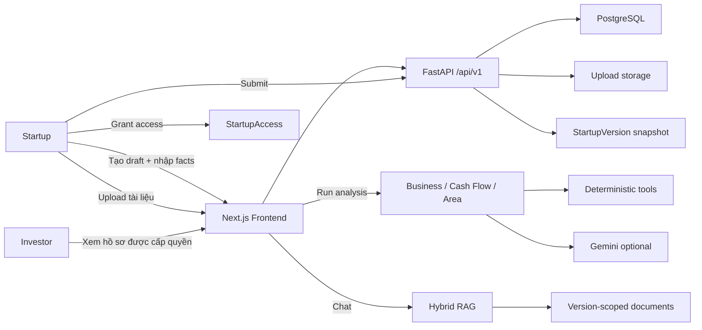

# Hải Đăng Khởi Nghiệp - Startup Lens

[](https://github.com/VTTr2004/hackathon-fpt-17-07-2026-da-quan-team/actions/workflows/ci.yml)

Hải Đăng Khởi Nghiệp là hệ thống thẩm định startup theo hướng **evidence-first**: startup chuẩn bị hồ sơ và tài liệu, nhà đầu tư đọc snapshot đã nộp, chạy các module phân tích độc lập và hỏi đáp trực tiếp trên tài liệu có trích dẫn nguồn.

AI trong dự án đóng vai trò trợ lý phân tích. Các phép tính, đối soát, chấm điểm và đo lường không gian được thực hiện bằng tool deterministic trong backend; LLM chỉ hỗ trợ diễn giải, tổng hợp và gợi ý câu hỏi tiếp theo dựa trên bằng chứng.

## Link nhanh

| Hạng mục | URL |
|---|---|
| Frontend production | TODO: dán URL Vercel production |
| Backend production | TODO: dán URL Render production |
| Video demo | TODO: dán link YouTube/Google Drive video demo |
| Slide thuyết trình | TODO: dán link Google Slides/Canva/PDF |

> Khi nộp bài, cập nhật bốn dòng production/video/slide ở bảng trên để giám khảo có thể mở trực tiếp.

## Mục lục

- [Câu chuyện dự án](#câu-chuyện-dự-án)
- [Hiệu quả mang lại](#hiệu-quả-mang-lại)
- [Đóng góp nổi bật](#đóng-góp-nổi-bật)
- [Bài toán](#bài-toán)
- [Tính năng chính](#tính-năng-chính)
- [Luồng người dùng](#luồng-người-dùng)
- [Kiến trúc](#kiến-trúc)
- [Module phân tích](#module-phân-tích)
- [Chatbot tài liệu](#chatbot-tài-liệu)
- [Dữ liệu mẫu](#dữ-liệu-mẫu)
- [Cài đặt và chạy](#cài-đặt-và-chạy)
- [Biến môi trường](#biến-môi-trường)
- [API chính](#api-chính)
- [Kiểm thử](#kiểm-thử)
- [Triển khai](#triển-khai)
- [Bảo mật và giới hạn](#bảo-mật-và-giới-hạn)

## Câu chuyện dự án

Một startup giai đoạn sớm thường không thiếu nỗ lực, nhưng lại thiếu một cách trình bày dữ liệu đủ rõ để nhà đầu tư có thể tin và kiểm chứng nhanh. Pitch deck có thể kể câu chuyện rất tốt, nhưng số liệu bán hàng nằm trong Excel, hợp đồng nằm trong PDF, thông tin địa điểm nằm trong ghi chú vận hành, còn các giả định thị trường lại nằm rải rác trong nhiều file khác nhau.

Ở phía nhà đầu tư, vấn đề ngược lại cũng rất thật: mỗi hồ sơ cần đọc nhiều tài liệu, đối chiếu nhiều con số, hỏi đi hỏi lại các câu cơ bản và vẫn phải cảnh giác với những nhận định không có nguồn. Nếu dùng AI một cách đơn giản, hệ thống có thể tóm tắt nhanh hơn nhưng cũng dễ tạo ra kết luận nghe thuyết phục mà không kiểm chứng được.

Hải Đăng Khởi Nghiệp được xây dựng như một "ngọn đèn" trong quá trình đó: không quyết định thay con người, không hứa hẹn thay nhà đầu tư, mà soi rõ dữ liệu nào đã có, dữ liệu nào còn thiếu, kết luận nào có bằng chứng và phép tính nào đã được tool kiểm tra. Startup có một lộ trình chuẩn bị hồ sơ rõ ràng hơn; nhà đầu tư có một bàn thẩm định có cấu trúc, có nguồn và có thể truy vết.

Trong demo, bộ dữ liệu mô phỏng "Góc Hồ Coffee" đại diện cho một mô hình F&B nhỏ đang chuẩn bị gọi vốn: có hồ sơ kinh doanh, dữ liệu bán hàng, mua hàng, sổ thu chi, hợp đồng thuê và thông tin địa điểm. Hệ thống không chỉ đọc tên quán hay mô tả ngành, mà còn hỗ trợ kiểm tra dòng tiền, xác minh các claim về khu vực và trả lời câu hỏi cụ thể trên tài liệu nguồn.

## Hiệu quả mang lại

| Đối tượng | Trước khi có hệ thống | Khi dùng Hải Đăng Khởi Nghiệp |
|---|---|---|
| Startup | Chuẩn bị hồ sơ theo cảm tính, dễ thiếu dữ liệu quan trọng | Biết rõ trường nào còn thiếu, tài liệu nào cần chia sẻ, phiên bản nào đã nộp |
| Nhà đầu tư | Đọc thủ công nhiều file, khó truy vết nguồn của từng kết luận | Có dashboard theo hồ sơ, phân tích theo module, citation và lịch sử version |
| Chuyên viên thẩm định | Dễ lệch rubric giữa các người review | Có contract dữ liệu, `ModuleReport`, tool calls và methodology thống nhất |
| Đội vận hành chương trình | Khó tổng hợp tình trạng nhiều hồ sơ | Có trạng thái completeness, phân quyền, audit log và dữ liệu có cấu trúc |
| Quy trình dùng AI | AI dễ tóm tắt thiếu căn cứ hoặc tự tính sai | Tool-first analysis, RAG có nguồn, fallback khi LLM lỗi, không biến thiếu dữ liệu thành điểm 0 |

Các hiệu quả được thiết kế để đo bằng những chỉ số thực tế sau:

- Thời gian từ lúc nhận hồ sơ đến lúc có bản review đầu tiên.
- Tỷ lệ nhận định có citation hoặc evidence đi kèm.
- Số lượng trường bắt buộc còn thiếu trước và sau khi startup bổ sung.
- Số lỗi đối soát dòng tiền được phát hiện trong workbook/tài liệu.
- Số câu hỏi làm rõ mà investor cần gửi lại cho startup.
- Mức độ nhất quán của báo cáo khi nhiều chuyên viên cùng xem một hồ sơ.

Điểm quan trọng là hệ thống không chỉ "làm nhanh hơn", mà làm cho quá trình thẩm định minh bạch hơn: người dùng thấy được dữ liệu đầu vào, công cụ đã chạy, cảnh báo thiếu dữ liệu và lý do hệ thống không kết luận khi chưa đủ bằng chứng.

## Đóng góp nổi bật

### Đóng góp sản phẩm

- Biến quy trình gọi vốn/thẩm định thành một data room hai phía, có vai trò `startup` và `investor` rõ ràng.
- Chuẩn hóa vòng đời hồ sơ: `draft -> completeness check -> submitted snapshot -> investor review -> new draft`.
- Giữ lịch sử phiên bản để investor không bị lẫn giữa dữ liệu cũ và dữ liệu mới.
- Đưa chat tài liệu vào đúng ngữ cảnh hồ sơ, giúp người dùng hỏi số liệu cụ thể thay vì tự mở từng file.

### Đóng góp kỹ thuật

- Thiết kế backend module hóa: Business Model, Cash Flow, Surrounding Area và Document Chatbot chạy độc lập qua contract chung.
- Áp dụng nguyên tắc tool-first: phép tính dòng tiền, scenario, scoring, POI metrics và claim verdict không giao cho LLM tự đoán.
- Xây dựng RAG có scope theo startup/version/user, kết hợp dense retrieval và BM25, có citation theo trang/sheet/dòng.
- Có graceful degradation: thiếu API key hoặc provider lỗi vẫn trả deterministic/fallback khi có thể, thay vì làm hỏng toàn bộ trải nghiệm.
- Có lớp bảo vệ prompt injection trong chatbot bằng cách coi câu hỏi, lịch sử chat và nguồn tài liệu là dữ liệu không đáng tin cậy.

### Đóng góp dữ liệu và kiểm thử

- Có bộ dữ liệu demo F&B mô phỏng đủ JSON, Excel và PDF để chạy qua luồng thẩm định thực tế.
- Có các cash-flow variants cố ý làm khó parser để kiểm tra double-count, chuyển nội bộ và quan hệ giữa nhiều file.
- Có tài liệu phương pháp, nguồn, glossary, giới hạn và test cases cho từng module quan trọng.
- Có CI cho backend/frontend, security tests, authorization tests và module tests.

### Đóng góp cho hệ sinh thái khởi nghiệp

- Giúp startup hiểu chuẩn dữ liệu cần chuẩn bị trước khi gặp nhà đầu tư.
- Giúp nhà đầu tư giảm thời gian xử lý các câu hỏi lặp lại và tập trung vào rủi ro thật.
- Tăng tính minh bạch vì mỗi nhận định quan trọng đều cần nguồn hoặc phải được đánh dấu là giả định.
- Khuyến khích cách dùng AI có trách nhiệm: AI hỗ trợ phân tích, nhưng con người vẫn là người kiểm tra, phê duyệt và ra quyết định cuối cùng.

## Bài toán

Quy trình thẩm định startup thường mất nhiều thời gian vì dữ liệu nằm rải rác trong pitch deck, kế hoạch kinh doanh, báo cáo tài chính, hợp đồng, bảng tính và tài liệu phụ trợ. Người đọc phải tự tổng hợp, đối chiếu nguồn, kiểm tra số liệu, tìm rủi ro và đặt câu hỏi bổ sung.

Dự án giải quyết vấn đề này bằng một data room có phân quyền:

- Startup tạo hồ sơ, nhập dữ kiện, tải tài liệu và nộp phiên bản chính thức.
- Nhà đầu tư chỉ xem hồ sơ đã được cấp quyền và đọc từ snapshot đã nộp.
- Các module phân tích chạy độc lập, trả về điểm, rủi ro, dữ liệu thiếu, câu hỏi cần làm rõ và bằng chứng.
- Chatbot RAG trả lời câu hỏi trên tài liệu startup, có citation theo file, trang, sheet hoặc dòng.

## Tính năng chính

| Nhóm | Đã có trong MVP |
|---|---|
| Xác thực và phân quyền | Đăng ký, đăng nhập, role `startup`/`investor`, Bearer token, route guard ở frontend |
| Quản lý hồ sơ | Tạo hồ sơ draft, cập nhật profile/facts, kiểm tra độ đầy đủ, nộp snapshot, tạo draft mới |
| Tài liệu | Upload `PDF`, `DOCX`, `PPTX`, `XLSX`, `TXT`, `MD`, `CSV`, `JSON`; trích xuất text; visibility `shared/private/restricted` |
| Chia sẻ | Startup cấp hoặc thu hồi quyền truy cập cho investor theo từng hồ sơ |
| Phiên bản | Lưu `StartupVersion`, xem lịch sử version, so sánh diff giữa hai phiên bản |
| Phân tích | Business Model, Cash Flow, Surrounding Area, output chung theo `ModuleReport` |
| Chat tài liệu | Hybrid RAG, BM25 fallback, embedding tùy provider, citations, lịch sử chat theo user và version |
| Bản đồ | Geocode, xác nhận tọa độ, POI map, deep-link Google Maps, satellite context |
| UI | Next.js App Router, giao diện sáng/tối, sidebar theo role, workspace startup/investor |

## Luồng người dùng

### Startup

1. Đăng ký tài khoản với vai trò `Startup`.
2. Tạo hồ sơ mới tại `/startups/new`.
3. Nhập dữ liệu nền: tên, ngành, giai đoạn, địa điểm, mô hình kinh doanh, dòng tiền, thông tin khu vực.
4. Upload tài liệu nền và chọn tài liệu được chia sẻ cho nhà đầu tư.
5. Mở trang chi tiết hồ sơ `/startups/{id}` để kiểm tra completeness.
6. Nộp hồ sơ. Backend tạo snapshot bất biến ở `StartupVersion`.
7. Cấp quyền cho investor.
8. Sau khi cần cập nhật, tạo draft mới dựa trên phiên bản hiện tại.

### Investor

1. Đăng ký tài khoản với vai trò `Investor`.
2. Chỉ thấy các hồ sơ đã được startup cấp quyền.
3. Mở hồ sơ để xem snapshot mới nhất và tài liệu `shared`.
4. Chạy từng module phân tích trên phiên bản đã nộp.
5. Xem điểm, findings, risks, missing data, methodology, evidence và tool calls.
6. Hỏi chatbot tài liệu để tra cứu số liệu hoặc kiểm chứng claim.

### Luồng end-to-end



## Kiến trúc

```text
Vercel / Next.js 16 / React 19 / TypeScript
        |
        | REST JSON + multipart/form-data
        v
Render / FastAPI / SQLAlchemy async
        |
        +-- PostgreSQL: users, startups, versions, documents, analyses, chat, audit
        +-- Upload storage: original files + extracted text + RAG index
        +-- Gemini: structured analysis narrative, embeddings, chat fallback
        +-- NVIDIA NIM: optional provider for RAG chat
        +-- Google/Goong/Nominatim: geocoding
        +-- Google Places API New: surrounding analysis
        +-- OpenStreetMap poi.db: map POI endpoint
        +-- Copernicus Sentinel-2 STAC: satellite context
```

### Cấu trúc thư mục

```text
backend/
  app/
    api/routes/                 REST API boundary
    core/                       config, auth, security
    db/                         SQLAlchemy async engine, migrations
    llm/                        Gemini/NVIDIA provider boundary
    models/                     PostgreSQL models
    modules/
      business_model/           Business Model analyzer, tools, docs
      cash_flow/                Cash Flow analyzer, ingestion, scoring, docs
      surrounding_area/         Map/location analyzer, providers, docs
      document_chatbot/         RAG ingestion, retrieval, index store
    schemas/                    Pydantic API contracts
    services/                   orchestration, parsing, chat
frontend/
  app/                          Next.js App Router screens
  lib/                          API client, auth context, tab config
  logo/                         brand source
  public/                       runtime public assets
  types/                        TypeScript contracts
sample-data/                    dữ liệu demo mô phỏng
plans/                          product/technical plans
scripts/                        dev/demo helper scripts
```

## Module phân tích

Tất cả module trả về cùng contract `ModuleReport`:

```json
{
  "module": "business_model|cash_flow|surrounding_area",
  "version": "0.1.0",
  "status": "completed|partial|insufficient_data|not_applicable|failed",
  "score": 0,
  "summary": "...",
  "findings": [],
  "risks": [],
  "missing_data": [],
  "assumptions": [],
  "recommended_questions": [],
  "evidence": [],
  "methodology": [],
  "tool_calls": [],
  "details": {}
}
```

### 1. Business Model

Mục tiêu: đánh giá vấn đề, giải pháp, khách hàng, mô hình doanh thu, kênh bán hàng, traction, kế hoạch phát triển và logic mở rộng.

Đặc điểm:

- Chỉ nhận dữ liệu thuộc Business Model/Development Plan; dữ liệu Cash Flow và Location bị loại ở boundary.
- Tính `data_completeness`, contribution/order economics và market sizing khi đủ input.
- Có flow subagent gồm Customer & Value Proposition, Retail Model & Channels, Economics & Market Evidence, Development Plan.
- Auditor loại claim thiếu evidence hoặc vượt phạm vi.
- Gemini chỉ diễn giải các finding đã được kiểm duyệt, không tự tính số.

Tài liệu chi tiết: [`backend/app/modules/business_model/README.md`](backend/app/modules/business_model/README.md)

### 2. Cash Flow

Mục tiêu: đánh giá sức khỏe dòng tiền, burn, runway, working capital, break-even và độ nhạy kịch bản.

Đặc điểm:

- Nhận facts tài chính và workbook `.xlsx` đã upload.
- Profiler chỉ gửi metadata sheet/header/sample rows cho AI mapping; AI không tính số.
- Tool chuẩn hóa cashbook, tổng hợp sales/purchases, loại giao dịch chuyển nội bộ, reconcile và tính metrics bằng `Decimal`.
- Trả về periods chuẩn hóa, base/adverse/severe scenarios, score, warnings, evidence và autofill proposals.

Tài liệu chi tiết: [`backend/app/modules/cash_flow/README.md`](backend/app/modules/cash_flow/README.md)

### 3. Surrounding Area

Mục tiêu: kiểm chứng claim của startup về khu vực, đối thủ, cầu địa phương và tính phù hợp vị trí.

Đặc điểm:

- Phân loại ngành phụ thuộc vị trí hay không; SaaS/fintech có thể trả `not_applicable`.
- Thiếu tọa độ đã xác nhận trả `insufficient_data`, không chấm 0.
- Analyzer v2 dùng Google Places API New để lấy quan sát POI theo nhóm, tính coverage, competitor density, demand proxy và verdict claim.
- Endpoint `/surrounding/map` vẫn dùng `poi.db` từ OpenStreetMap để render POI và deep-link Google Maps nếu đã build dữ liệu local.
- Có satellite context tùy chọn qua Copernicus Sentinel-2 STAC.
- Không đoán giá thuê, popular times hoặc thông tin không có nguồn; các mục này được đánh dấu thiếu dữ liệu.

Tài liệu chi tiết: [`backend/app/modules/surrounding_area/README.md`](backend/app/modules/surrounding_area/README.md)

## Chatbot tài liệu

Document Chatbot là pipeline RAG theo scope startup/version:

1. Tạo synthetic profile document từ dữ kiện hồ sơ.
2. Parse tài liệu `CSV`, `JSON`, `XLSX`, `TXT`, `MD`, `PDF`, `DOCX`, `PPTX`.
3. Chunk có metadata `page`, `slide`, `sheet`, `row`.
4. Build hoặc load hybrid index theo `startup_id:version` hoặc `startup_id:draft`.
5. Retrieve bằng dense embedding + BM25, trộn bằng Reciprocal Rank Fusion.
6. Rerank tùy chọn.
7. Generate câu trả lời chỉ từ nguồn đã retrieve, chuẩn hóa citation `[1]`, `[2]`.
8. Nếu LLM thiếu key hoặc lỗi quota/timeout, fallback extractive thay vì fail request.

Provider:

- Mặc định: Gemini (`gemini-flash-latest`, `gemini-embedding-001`).
- Tùy chọn: NVIDIA NIM (`openai/gpt-oss-120b`, `nvidia/nv-embedqa-e5-v5`).

Tài liệu chi tiết: [`backend/app/modules/document_chatbot/docs/README.md`](backend/app/modules/document_chatbot/docs/README.md)

## Dữ liệu mẫu

### Góc Hồ Coffee

Thư mục [`sample-data/goc-ho-coffee`](sample-data/goc-ho-coffee) chứa bộ hồ sơ mô phỏng cho quán cà phê:

- Hồ sơ kinh doanh JSON.
- Hồ sơ pháp lý PDF.
- Workbook bán hàng 910 dòng và hóa đơn mẫu.
- Workbook mua hàng, chi phí và hóa đơn mẫu.
- Sổ thu chi 260 giao dịch.
- Dữ liệu địa điểm, vận hành, hợp đồng thuê, điện nước.

Số liệu kiểm tra nhanh:

| Chỉ số | Giá trị |
|---|---:|
| Tổng doanh thu thuần | 671.303.450 VND |
| Tổng mua hàng và chi phí | 761.931.040 VND |
| Tổng tiền vào | 821.303.450 VND |
| Tổng tiền ra | 761.931.040 VND |
| Số dư đầu kỳ | 380.000.000 VND |
| Số dư cuối kỳ | 439.372.410 VND |

### AI Cash Flow Variants

Thư mục [`sample-data/ai-cashflow-variants`](sample-data/ai-cashflow-variants) chứa ba case kiểm thử AI tự trích xuất dòng tiền:

- Tiệm bánh Mây Sớm.
- Nhà hàng Bếp Việt 36.
- Cửa hàng tiện lợi Đêm 24.

Các case cố ý thay đổi tên sheet, cách đặt bảng, thời điểm ghi nhận và quan hệ giữa Excel/PDF/CSV để kiểm tra khả năng chọn tool, tránh double-count và loại chuyển nội bộ.

### Nhóm field dữ liệu nên có

Tài liệu [`Data mock/data.md`](Data%20mock/data.md) tổng hợp các trường hữu ích cho bài toán thực tế. Các nhóm quan trọng:

- Hồ sơ startup: `name`, `legal_name`, `industry`, `stage`, `business_type`, `founded_date`, `website_url`, `primary_location`, `founders`, `employee_count`.
- Business Model: `problem`, `solution`, `target_customers`, `core_products`, `differentiation`, `revenue_model`, `sales_channels`, `pricing_model`, `traction`, `expansion_plan`, `fundraising_need`, `use_of_funds`.
- Cash Flow: `current_cash`, `minimum_cash_buffer`, `monthly_revenue`, `monthly_expense`, `fixed_monthly_costs`, `variable_cost_ratio`, `accounts_receivable`, `accounts_payable`, `inventory`, `financial_periods`, `cash_flow_dataset`.
- Funding: `total_funding_usd`, `funding_rounds_count`, `latest_round_type`, `latest_round_amount`, `investors`, `cap_table_summary`, `valuation_pre_money`, `valuation_post_money`.
- Location: `exact_location`, `lat`, `lon`, `location_type`, `area_m2`, `tenure`, `rent_cost`, `operating_hours`, `location_dependency`, `target_customer_radius_m`, `known_nearby_competitors`, `area_claims`.
- Legal/Evidence: `registration_number`, `tax_code`, `licenses`, `ip_assets`, `material_contracts`, `legal_risks`, `document_checklist_status`, `evidence_refs`.

## Cài đặt và chạy

### Yêu cầu

- Docker Desktop nếu chạy toàn bộ stack bằng Docker.
- Python 3.12 nếu chạy backend local.
- Node.js 24 nếu chạy frontend local theo CI.
- PostgreSQL 17 hoặc service `postgres` trong `docker-compose.yml`.

### Chạy nhanh bằng Docker

```powershell
Copy-Item .env.example .env
docker compose up --build
```

Sau khi stack chạy:

- Frontend: [http://localhost:3000](http://localhost:3000)
- Swagger: [http://localhost:8000/docs](http://localhost:8000/docs)
- Health: [http://localhost:8000/api/v1/health](http://localhost:8000/api/v1/health)
- PostgreSQL trên host: `localhost:5433`

### Chạy backend local

```powershell
docker compose up -d postgres
cd backend
py -3.12 -m venv .venv
.\.venv\Scripts\Activate.ps1
python -m pip install --upgrade pip
pip install -e ".[dev]"
uvicorn app.main:app --reload --host 127.0.0.1 --port 8000
```

Backend cần `DATABASE_URL` hợp lệ. Mặc định `.env.example` trỏ tới PostgreSQL local ở port `5433`.

### Chạy frontend local

```powershell
cd frontend
npm ci
npm.cmd run dev -- -p 3000
```

Hoặc dùng helper script:

```powershell
.\scripts\run-frontend-dev.ps1
.\scripts\run-backend-dev.ps1
```

## Biến môi trường

| Biến | Bắt buộc | Mô tả |
|---|:---:|---|
| `DATABASE_URL` | Có | PostgreSQL async SQLAlchemy URL |
| `AUTO_CREATE_TABLES` | Không | Tự tạo/migrate bảng khi app khởi động |
| `CORS_ORIGINS` | Có khi deploy | Danh sách origin frontend được phép gọi API |
| `UPLOAD_DIR` | Không | Thư mục lưu file upload và RAG index |
| `MAX_UPLOAD_MB` | Không | Giới hạn dung lượng upload, mặc định 25 MB |
| `AUTH_SECRET` | Có khi deploy | Secret HMAC token, production cần chuỗi riêng tối thiểu 32 ký tự |
| `AUTH_TOKEN_TTL_HOURS` | Không | Thời hạn token |
| `LLM_PROVIDER` | Không | `gemini` hoặc `nvidia` cho RAG |
| `GEMINI_API_KEY` | Không | Một key hoặc nhiều key cách nhau bằng dấu phẩy |
| `GEMINI_MODEL` | Không | Model phân tích/narrative, mặc định theo env |
| `GEMINI_EMBED_MODEL` | Không | Model embedding cho RAG |
| `NVIDIA_API_KEY` | Không | Bật provider NVIDIA cho RAG |
| `RAG_TOP_K` | Không | Số nguồn đưa vào answer |
| `RAG_CANDIDATE_K` | Không | Số candidate trước rerank |
| `RAG_USE_RERANK` | Không | Bật/tắt rerank LLM |
| `GOONG_API_KEY` | Không | Geocoding địa chỉ Việt Nam nếu cấu hình |
| `GOOGLE_GEOCODING_API_KEY` | Không | Google Geocoding fallback |
| `GOOGLE_PLACES_API_KEY` | Cần cho Area analyzer v2 | Google Places API New cho phân tích khu vực |
| `NEXT_PUBLIC_API_URL` | Có ở frontend | URL backend API, ví dụ `http://localhost:8000/api/v1` |
| `NEXT_PUBLIC_GOOGLE_MAPS_API_KEY` | Không | Hiển thị Google Maps ở frontend; thiếu key sẽ fallback map khác |

## API chính

Tất cả endpoint backend có prefix `/api/v1`. Một số luồng API chính:

```text
POST /api/v1/auth/register
POST /api/v1/auth/login
GET  /api/v1/auth/me
POST /api/v1/startups
GET  /api/v1/startups/{id}/completeness
POST /api/v1/startups/{id}/extractions
GET  /api/v1/startups/{id}/extractions/{extraction_id}
POST /api/v1/startups/{id}/extractions/{extraction_id}/confirm
POST /api/v1/startups/{id}/submit
POST /api/v1/startups/{id}/draft
GET  /api/v1/startups/{id}/versions
POST /api/v1/startups/{id}/documents
POST /api/v1/startups/{id}/analyses/business_model
POST /api/v1/startups/{id}/analyses/cash_flow
POST /api/v1/startups/{id}/analyses/surrounding_area
POST /api/v1/startups/{id}/chat
POST /api/v1/surrounding/geocode
GET  /api/v1/surrounding/map
```

### Auth

| Method | Endpoint | Mô tả |
|---|---|---|
| `POST` | `/auth/register` | Tạo tài khoản startup/investor |
| `POST` | `/auth/login` | Đăng nhập, trả access token |
| `GET` | `/auth/me` | Lấy user hiện tại |
| `GET` | `/auth/investors` | Startup lấy danh sách investor để cấp quyền |

### Startup và version

| Method | Endpoint | Quyền | Mô tả |
|---|---|---|---|
| `GET` | `/startups` | Đăng nhập | Danh sách hồ sơ theo ownership/access |
| `POST` | `/startups` | Startup | Tạo hồ sơ draft |
| `GET` | `/startups/{id}` | Có quyền | Startup đọc live draft; investor đọc latest snapshot |
| `PATCH` | `/startups/{id}` | Owner + draft | Cập nhật profile/facts |
| `GET` | `/startups/{id}/completeness` | Owner | Kiểm tra dữ liệu và tài liệu trước khi nộp |
| `POST` | `/startups/{id}/submit` | Owner + draft | Tạo snapshot và khóa phiên bản |
| `POST` | `/startups/{id}/draft` | Owner | Tạo draft mới sau khi đã nộp |
| `GET` | `/startups/{id}/versions` | Có quyền | Danh sách version đã nộp |
| `GET` | `/startups/{id}/versions/diff` | Có quyền | So sánh hai version |
| `GET` | `/startups/{id}/access` | Owner | Danh sách quyền investor |
| `POST` | `/startups/{id}/access` | Owner | Cấp quyền investor |
| `DELETE` | `/startups/{id}/access/{investor_id}` | Owner | Thu hồi quyền investor |

### Documents, analyses, chat, surrounding

| Method | Endpoint | Quyền | Mô tả |
|---|---|---|---|
| `GET` | `/startups/{id}/documents` | Có quyền | Startup thấy tất cả; investor thấy shared docs trong latest version |
| `POST` | `/startups/{id}/documents` | Owner + draft | Upload và parse tài liệu |
| `PATCH` | `/startups/{id}/documents/{document_id}` | Owner + draft | Đổi visibility nếu tài liệu chưa bị khóa trong version |
| `POST` | `/startups/{id}/extractions` | Owner + draft | Sinh candidate dữ liệu hồ sơ từ tài liệu đã upload |
| `GET` | `/startups/{id}/extractions/{extraction_id}` | Owner + draft | Xem kết quả trích xuất kèm bằng chứng theo trường |
| `POST` | `/startups/{id}/extractions/{extraction_id}/confirm` | Owner + draft | Xác nhận candidate và ghi vào hồ sơ draft |
| `GET` | `/startups/{id}/analyses` | Có quyền | List analysis theo user và version/draft |
| `POST` | `/startups/{id}/analyses/{module}` | Startup/Investor theo module | Chạy `business_model`, `cash_flow`, `surrounding_area` |
| `GET` | `/startups/{id}/chat/history` | Có quyền | Lịch sử chat theo user và version/draft |
| `POST` | `/startups/{id}/chat` | Có quyền | Hỏi đáp tài liệu có citation |
| `POST` | `/surrounding/geocode` | Đăng nhập | Địa chỉ sang candidates tọa độ, cần xác nhận |
| `GET` | `/surrounding/map` | Investor | POI map từ `poi.db` |
| `GET` | `/surrounding/satellite` | Investor | Sentinel-2 scene metadata/quicklook |

## Completeness trước khi nộp

Backend yêu cầu các nhóm dữ liệu sau trước khi `submit`:

- Tên startup.
- Lĩnh vực.
- Giai đoạn.
- Địa điểm chính xác.
- Nhu cầu hoặc vấn đề khách hàng.
- Giải pháp.
- Khách hàng mục tiêu.
- Nguồn doanh thu.
- Tiền mặt hiện có.
- Dòng tiền theo kỳ.
- Ít nhất một tài liệu nền ở visibility `shared`.

`current_cash` phải là số không âm. Nếu thiếu dữ liệu, API trả danh sách `missing_fields`, `missing_documents`, `format_errors` và `can_submit=false`.

## Kiểm thử

### Backend

```powershell
cd backend
pip install -e ".[dev]"
ruff check app tests --select E9,F63,F7,F82
python -m pytest
```

Chạy riêng các module:

```powershell
python -m pytest app/modules/cash_flow/tests tests/test_cash_flow_tools.py tests/test_cash_flow_extractor.py tests/test_cash_flow_regressions.py -q
python -m pytest tests/surrounding_area -q
python -m pytest tests/test_security.py tests/test_security_boundaries.py tests/test_authorization.py -q
```

### Frontend

```powershell
cd frontend
npm ci
npm.cmd run lint
npm.cmd run build
```

Lưu ý: `next build` có thể cần mạng để tải Google Font `Inter` thông qua `next/font`.

### CI

GitHub Actions chạy trên `main` và pull request:

- Python 3.12.
- Backend: install dev deps, ruff critical rules, pytest.
- Node.js 24.
- Frontend: `npm ci`, lint, production build.

## Triển khai

Kiến trúc production đề xuất:

```text
Vercel (Next.js) -> Render (FastAPI) -> Supabase PostgreSQL
```

Chi tiết từng bước nằm ở [`DEPLOYMENT.md`](DEPLOYMENT.md).

Tóm tắt:

1. Tạo Supabase PostgreSQL, lấy session pooler URI dạng `postgresql+asyncpg://...`.
2. Tạo Render Blueprint từ [`render.yaml`](render.yaml), cấu hình `DATABASE_URL`, `CORS_ORIGINS`, `AUTH_SECRET`, LLM/maps keys.
3. Import frontend vào Vercel, root directory là `frontend`.
4. Cấu hình `NEXT_PUBLIC_API_URL=https://<render-service>/api/v1`.
5. Sau khi có Vercel production domain, cập nhật `CORS_ORIGINS` trên Render.

Lưu ý Render free plan có filesystem tạm thời. File upload trong `/tmp/uploads` có thể mất sau restart/redeploy; production thật nên dùng persistent disk hoặc object storage.

## Kịch bản demo gợi ý

1. Mở frontend local hoặc production.
2. Đăng ký một tài khoản Startup và một tài khoản Investor.
3. Startup tạo hồ sơ "Góc Hồ Coffee".
4. Upload các file trong [`sample-data/goc-ho-coffee`](sample-data/goc-ho-coffee).
5. Kiểm tra completeness, nộp hồ sơ và cấp quyền cho investor.
6. Investor mở hồ sơ được chia sẻ.
7. Chạy Cash Flow để xem doanh thu, dòng tiền, runway và cảnh báo reconciliation.
8. Chạy Surrounding Area sau khi xác nhận tọa độ và cấu hình `GOOGLE_PLACES_API_KEY`.
9. Hỏi chatbot: "Tổng doanh thu thuần 3 tháng là bao nhiêu?" và kiểm tra citation.
10. Hỏi một câu không có trong tài liệu để minh họa cơ chế từ chối suy diễn.

## Bảo mật và giới hạn

- Mật khẩu được hash bằng PBKDF2-HMAC-SHA256.
- Token là HMAC signed token có thời hạn, cấu hình bởi `AUTH_TOKEN_TTL_HOURS`.
- Backend trả `404` cho tài nguyên không có quyền để tránh lộ sự tồn tại hồ sơ.
- Investor chỉ đọc latest submitted snapshot và tài liệu `shared`.
- Analysis của investor được scope theo `startup_version_id` và `created_by_id`.
- Chat history được scope theo startup, user và version/draft.
- RAG prompt coi `USER_QUESTION`, `CHAT_HISTORY` và `SOURCES` là dữ liệu không đáng tin cậy, không phải instruction.
- Tài liệu đã nằm trong snapshot đã nộp không được đổi visibility; muốn cập nhật phải upload bản mới trong draft.
- Rate limit cho geocode/map/satellite hiện là in-process, theo user ID; multi-instance production nên chuyển sang Redis.
- Surrounding Area phụ thuộc chất lượng dữ liệu bản đồ và giới hạn provider; thiếu dữ liệu trả `insufficient_data`, không được biến thành điểm 0.
- Kết quả phân tích không phải tư vấn đầu tư, tư vấn pháp lý, kế toán hoặc thuế chính thức.

## Tài liệu tham khảo nội bộ

- [`function.md`](function.md): mô tả tính năng tổng thể và phạm vi MVP.
- [`BAO_CAO_CHUC_NANG_VA_LUONG_FE_BE.md`](BAO_CAO_CHUC_NANG_VA_LUONG_FE_BE.md): review luồng FE/BE.
- [`security_audit_report.md`](security_audit_report.md): audit bảo mật và logic nghiệp vụ.
- [`plans/trung-plans.md`](plans/trung-plans.md): plan sản phẩm, module và tiêu chí nghiệm thu.
- [`plans/tuan-rag-chat-plan.md`](plans/tuan-rag-chat-plan.md): kế hoạch RAG chatbot.
- [`plans/surrounding-area.md`](plans/surrounding-area.md): nghiên cứu và plan module khu vực.
- [`DEPLOYMENT.md`](DEPLOYMENT.md): hướng dẫn Supabase + Render + Vercel.
