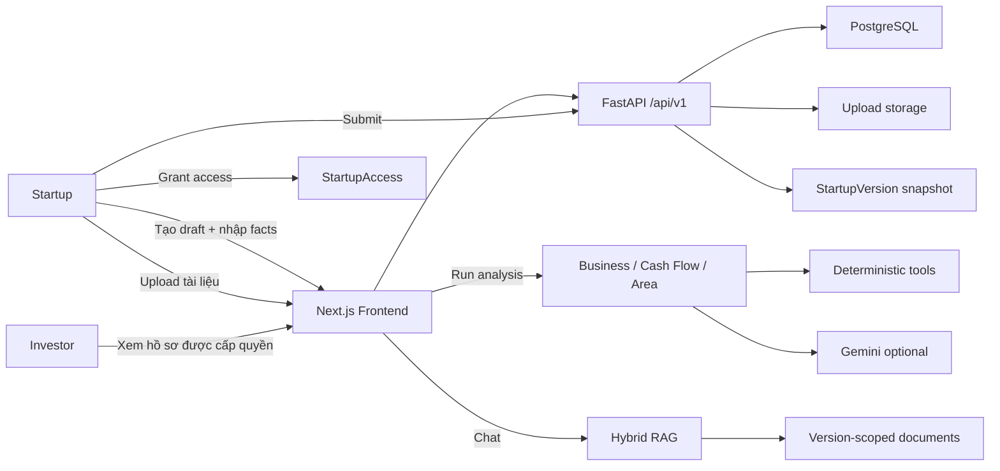

# Kiến trúc & Luồng hệ thống

> **Tài liệu kỹ thuật:** [⌂ Tổng quan](../README.md) · [Kiến trúc](ARCHITECTURE.md) · [Module & AI](MODULES.md) · [API](API.md) · [Cài đặt & Kiểm thử](DEVELOPMENT.md) · [Dữ liệu mẫu](SAMPLE_DATA.md) · [Bảo mật](SECURITY.md) · [Triển khai](../DEPLOYMENT.md)

**Hải Đăng Khởi Nghiệp** biến hồ sơ phân mảnh của startup thành _hồ sơ nhu cầu có cấu trúc_, giúp NIC tìm đúng đối tác trong hệ sinh thái, giải thích lý do phù hợp, soạn nội dung kết nối và đưa cuộc gặp vào lịch — mọi bước then chốt có con người phê duyệt. Kiến trúc dưới đây hiện thực hóa hành trình đó theo nguyên tắc **có cấu trúc, có bằng chứng, có con người phê duyệt**: frontend chỉ trình bày và thu thập; backend giữ dữ liệu, chạy công cụ deterministic, chọn snapshot bất biến và gọi LLM khi cần diễn giải.

## Tổng quan kiến trúc

```text
Vercel / Next.js 16 / React 19 / TypeScript
        |
        | REST JSON + multipart/form-data
        v
Render / FastAPI / SQLAlchemy async
        |
        +-- PostgreSQL: users, startups, versions, documents, analyses, chat, audit
        +-- Upload storage: original files + extracted text + RAG index
        +-- Gemini: structured analysis narrative, PDF/image OCR, embeddings, chat fallback
        +-- NVIDIA NIM: optional provider for RAG chat
        +-- Google/Goong/Nominatim: geocoding
        +-- Google Places API New: surrounding analysis
        +-- OpenStreetMap poi.db: map POI endpoint
        +-- Copernicus Sentinel-2 STAC: satellite context
```

Frontend không truy cập database hoặc LLM trực tiếp. Mọi giao tiếp đi qua REST API `/api/v1`; backend chịu trách nhiệm xác thực, phân quyền, chọn snapshot, đọc tài liệu, chạy tool deterministic và gọi LLM khi cần.

## Cấu trúc thư mục

```text
backend/
  app/
    api/routes/                 REST API boundary
    core/                       config, auth, security
    db/                         SQLAlchemy async engine, migrations
    llm/                        Gemini/NVIDIA provider boundary
    models/                     PostgreSQL models
    modules/
      business_model/           Business Model analyzer, tools, docs
      cash_flow/                Cash Flow analyzer, ingestion, scoring, docs
      surrounding_area/         Map/location analyzer, providers, docs
      document_chatbot/         RAG ingestion, retrieval, index store
      profile_ingestion/        Trích xuất field hồ sơ từ tài liệu (extractions)
      matching/                 Investor-startup fit scoring, hard filters, explanations
    schemas/                    Pydantic API contracts
    services/                   orchestration, parsing, chat
frontend/
  app/                          Next.js App Router screens
  lib/                          API client, auth context, tab config
  logo/                         brand source
  public/                       runtime public assets
  types/                        TypeScript contracts
sample-data/                    dữ liệu demo mô phỏng
plans/                          product/technical plans
scripts/                        dev/demo helper scripts
docs/                           tài liệu kỹ thuật + AI log automation
```

## Luồng người dùng

### Startup

1. Đăng ký tài khoản với vai trò `Startup`.
2. Tạo hồ sơ mới tại `/startups/new`.
3. Nhập dữ liệu nền: tên, ngành, giai đoạn, địa điểm, mô hình kinh doanh, dòng tiền, thông tin khu vực.
4. Upload tài liệu nền và chọn tài liệu được chia sẻ cho nhà đầu tư.
5. Mở trang chi tiết hồ sơ `/startups/{id}` để kiểm tra completeness.
6. Nộp hồ sơ. Backend tạo snapshot bất biến ở `StartupVersion`.
7. Bật discovery; khi có yêu cầu, phê duyệt hoặc từ chối quyền mở Data Room.
8. Sau khi cần cập nhật, tạo draft mới dựa trên phiên bản hiện tại.

### Investor

1. Đăng ký tài khoản với vai trò `Investor`.
2. Cấu hình Investment Thesis và xem candidate card công khai của startup discoverable.
3. Lọc, so sánh và shortlist mà không cần startup phê duyệt.
4. Gửi yêu cầu mở Data Room khi muốn thẩm định sâu.
5. Sau khi startup cấp quyền, mở snapshot mới nhất và tài liệu `shared`.
6. Chạy module phân tích và hỏi chatbot tài liệu để kiểm chứng claim.

### Luồng end-to-end



## Nguyên tắc thiết kế

- **Tool-first:** phép tính dòng tiền, scenario, scoring, POI metrics và claim verdict thực hiện bằng tool deterministic, không giao cho LLM tự đoán.
- **Evidence-first:** mỗi nhận định quan trọng cần nguồn hoặc được đánh dấu là giả định; thiếu dữ liệu trả `insufficient_data` thay vì chấm 0.
- **Module hóa:** các module phân tích chạy độc lập qua contract chung `ModuleReport` (xem [MODULES.md](MODULES.md)).
- **Graceful degradation:** thiếu API key hoặc provider lỗi vẫn trả deterministic/fallback khi có thể.
